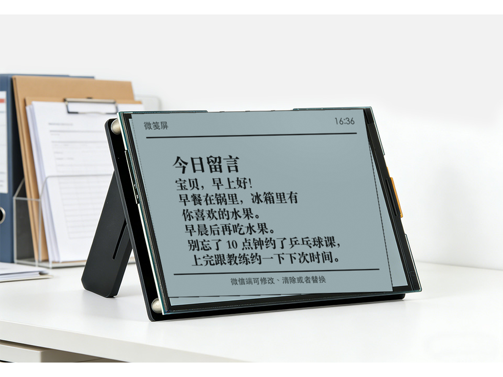

# WeClawBot

Open firmware for WeClawBot, a WeChat-connected, AI-assisted desktop note
display based on the Waveshare ESP32-S3-RLCD-4.2 board.

[中文说明](README.zh-CN.md) | [Live website](https://weclawbot.link/) | [Install and configure](https://openbrt.github.io/weclawbot/web/)



## What It Does

WeClawBot turns a small reflective screen into a calm, always-on message surface:

- Scan a QR code with WeChat to connect the bot.
- Send text, lists, reminders, or photos in WeChat and let the device show them
  as a desktop note, calendar page, or black-and-white photo frame.
- Send corrections such as “修改为...” or “清屏” from WeChat.
- Keep the fallback calendar, clock, indoor temperature, indoor humidity, Wi-Fi
  state, and plug/battery state visible when there is no active note.
- Keep Wi-Fi, WeChat state, notes, and the configured curator endpoint across
  normal firmware updates.
- Use the local browser install page to flash firmware and configure Wi-Fi over
  Web Serial.

The firmware is public so users can inspect what runs in their private
environment. Cloud-side curator services are intentionally not included in this
repository.

## Hardware

- Board: Waveshare ESP32-S3-RLCD-4.2
- MCU: ESP32-S3 with PSRAM
- Display: 4.2-inch reflective LCD, 400 x 300
- USB: native ESP32-S3 USB Serial/JTAG
- Flash layout: 16 MB, DIO, 80 MHz

Button behavior in firmware `0.1.46`:

| Button | Short press | Long press |
| --- | --- | --- |
| Left button | Previous page | Clear text notes after 3 seconds |
| Right button | Next page | Clear text, photo, and WeChat login after 5 seconds |
| Middle power button | Reserved by hardware | Power on/off |

Public firmware shows `微笺屏` in the screen header. Local development builds can
enable `CONFIG_WEC_DEVELOPMENT_BUILD` to show `微笺（开发版）` instead.

## Install

Open the browser installer:

https://openbrt.github.io/weclawbot/web/

Chrome or Edge is recommended because the page uses Web Serial and WebUSB.

To feel the product interaction before flashing hardware, open the live
experience:

https://weclawbot.link/

To enter download mode manually:

1. Unplug USB-C.
2. Hold `BOOT`.
3. Plug USB-C back in.
4. Release `BOOT` after 1 to 2 seconds.

Normal updates do not erase NVS, so Wi-Fi and WeChat binding are preserved unless
you intentionally clear them.

## Build From Source

This project uses ESP-IDF.

```bash
./scripts/idf.sh build
./scripts/idf.sh -p /dev/cu.usbmodem21101 flash
./scripts/prepare_web_firmware.sh
```

The generated browser-install firmware parts are placed in `web/firmware/`.

## Privacy Boundary

The ESP32 owns the WeChat QR login and the `getupdates` loop. A configured cloud
curator endpoint only receives the message content needed to decide what should
be shown on screen. The firmware does not publish the WeChat bot token to that
endpoint.

Users can set their own provider, endpoint, and API token from the local
configuration page. The default WeClawBot service is one provider, not a hidden
requirement.

## Repository Scope

This repository contains:

- ESP32 firmware source.
- Browser install and local configuration page.
- User-facing documentation.
- Prebuilt firmware binaries for the hosted installer.

This repository does not contain:

- WeClawBot cloud curator implementation.
- Server logs or deployment scripts.
- Private Tencent Cloud, COS, SCF, or model-provider credentials.

## License

See [LICENSE](LICENSE).
