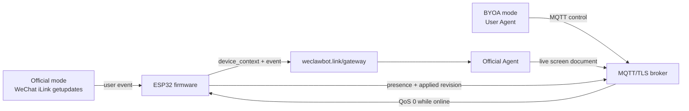

# WeClawBot Agent Direct Control Protocol

## Purpose

WeChat iLink `getupdates` is an inbound long-poll event source. It wakes the
firmware when a person sends a message, but it cannot safely deliver a timer,
token-budget card, or other agent-originated screen update to the device.

WeClawBot uses two ownership modes. Official mode accepts WeChat/iLink input
and routes it through the official Agent. BYOA mode is different: the user's
own Agent owns the screen over MQTT, and WeChat/iLink input is disabled and
ignored.



The gateway is a rendezvous, pairing, and routing service. It does not curate
text, render pixels, or keep a per-device mailbox.

In official mode, the same public `/gateway` endpoint also accepts an internal
device bootstrap envelope:

```json
{ "schema": "weclawbot.gateway.v1", "operation": "bootstrap", "mode": "official", "device_id": "off_wec_abcd1234" }
```

The response is `weclawbot.gateway.bootstrap.v1` with scoped device MQTT/WSS
credentials. The official bridge subscribes to that device's `events/status`
topics, runs the hosted curator/Agent path, and publishes control messages back
to the device. In custom Agent mode, `/byoa` keeps the six-digit claim flow and
the user's Agent subscribes to the same topic shape directly. Once BYOA is
paired, firmware does not forward WeChat text, voice, image, file, feedback, or
reply events to that Agent.

## One screen capability, two user entry points

From the user's perspective, there is one capability: **put this on my
screen**. It may originate in either place:

| Entry point | Path | Completion signal |
| --- | --- | --- |
| Official WeChat conversation | iLink -> firmware -> MQTT event -> official Agent -> MQTT control -> firmware | Firmware may send the requested WeChat reply and publishes `applied` or `rejected`. |
| BYOA/user Agent, timer, automation, web UI, or another tool | Agent -> MQTT control -> firmware | Firmware publishes `applied` or `rejected` to the Agent. |

Both paths use the exact same `screen_document` validation and revision rules.
Only the source metadata differs. In official mode, a WeChat-originated event includes a
`reply_target` so the firmware can send a human-facing acknowledgement through
iLink using its own private WeChat credential. Agent-originated updates have
no reply target and never require a WeChat round trip.

```json
{
  "schema": "weclawbot.screen_intent.v1",
  "origin": { "kind": "wechat", "correlation_id": "event-id", "reply_target": "opaque-wechat-user-ref" },
  "document": { "schema": "weclawbot.screen_document.v1" },
  "wechat_reply": "optional, only when origin.kind is wechat"
}
```

## Pairing

1. A user selects **自定义智能体** on the configuration page. The page keeps the
   internal route private; users never type or copy a gateway URL. Wi-Fi is
   sufficient and a WeChat scan is not required.
2. Firmware calls the internal `/byoa` bootstrap operation, receives a
   short-lived temporary MQTT identity, and shows `AI智能体绑定码：123456`. The
   code expires after ten minutes.
3. The user runs the Hermes/OpenClaw plugin's bind command and enters that
   code. Its claim request uses the same internal `/byoa` path.
4. The gateway provisions separate least-privilege identities. It returns the
   agent credential in the HTTPS claim response and delivers the device
   credential exactly once over the temporary pairing MQTT topic. No Agent
   callback URL exists.
5. Firmware stores its scoped device credential, reconnects, and publishes
   `online` plus the live `device_context`; the agent may then publish a
   screen document. The configuration page's `重置智能体配对` action clears
   the device-local BYOA credential, saves BYOA as the current ownership mode,
   reboots the device, and forces a fresh pairing flow. The old Agent host
   should also run `weclawbotctl unbind --yes` to remove its local profile.

There is no Agent URL for an end user to discover or enter.
The configuration choice selects the official WeClawBot Agent or this
user-owned Agent pairing flow.

If a device loses its local BYOA credential while the gateway still has an old
binding, the next device bootstrap revokes that stale device/agent ACL before
issuing a fresh pairing code. This keeps physical-device recovery possible
without asking the user to find an old Agent installation.

### Internal pairing contract

`POST /byoa` accepts only these two envelopes:

```json
{ "schema": "weclawbot.byoa.v1", "operation": "bootstrap", "device_id": "wec_abcd1234" }
```

```json
{ "schema": "weclawbot.byoa.v1", "operation": "claim", "code": "123456", "agent_name": "Hermes" }
```

The production broker grants only these device-specific topics:

| Topic | Device | Agent |
| --- | --- | --- |
| `weclawbot/v1/devices/<device-id>/control` | subscribe | publish |
| `weclawbot/v1/devices/<device-id>/events` | publish | subscribe |
| `weclawbot/v1/devices/<device-id>/status` | publish | subscribe |

The one-time bootstrap identity may subscribe only to
`weclawbot/v1/pairings/<pairing-id>`.

Official devices use the same ACL shape, but with an `off_` device id prefix so
official and BYOA credentials cannot collide when a user switches modes.

## BYOA Owns The Screen

The BYOA firmware flow is deliberately independent of WeChat: the calendar
dashboard shows only the six-digit binding code, and, once paired, the user's
Agent owns the screen. Firmware must not use WeChat/iLink as a BYOA ingress,
reply channel, fallback path, or runtime dependency.

If a stale or accidental WeChat item reaches the firmware while BYOA is active,
the item is logged as `ingress_ignored` and dropped. It is not queued, not sent
to MQTT `events`, not shown as thinking, and not replied to through iLink.

BYOA Agents must use their own user-facing channel if they need a conversation.
Firmware accepts `screen_document`, `activity`, and `screen_clear` over MQTT.
`wechat_reply` is rejected, and `wechat_reply` embedded in a `screen_intent` is
ignored while the document portion, if valid, can still be applied.

### Thinking is an activity, not a waiting screen

An Agent may publish a short-lived activity message before it begins a model
call or a multi-step task:

```json
{
  "schema": "weclawbot.activity.v1",
  "state": "thinking",
  "ttl_seconds": 45,
  "correlation_id": "agent-task-id"
}
```

Firmware overlays the **thinking desktop pet** while work is actually in
progress, then restores the exact previously shown page when it receives
`state: "idle"`, an applied screen document, a failure, or TTL expiry. It does
not erase the current note, photo, or calendar and cannot become a permanent
busy state. This makes a spare screen useful beside the Agent's computer or
server: its owner can see that the Agent is working without opening a terminal.

In BYOA mode the *unpaired* dashboard contains only the renewable pairing code
and no pet. Once paired, the idle dashboard is a quiet Agent-owned status
screen. The thinking pet is an explicit, temporary activity overlay, not the
BYOA idle decoration.

## Live-only MQTT semantics

This transport intentionally is not an offline mailbox:

- TLS, `clean_start=true`, and `session_expiry_seconds=0`;
- no retained control documents and no broker-side offline command queue;
- QoS 1 only while the device is currently online;
- device emits `online`, `context`, and `applied` events;
- when a device reconnects, the Agent generates a fresh current state instead
  of replaying work made while it was absent;
- normal periodic cards respect `recommended_min_update_interval_ms` (initial
  value: 60 seconds) and coalesce rapid updates locally.

That gives a broker fleet responsibility for long-lived sockets, not a
`weclawbot.link` Node process. It also prevents a stale reminder or sensitive
status card from appearing hours after an offline screen reconnects.

## Hardware context

Official WeChat events and Agent online events carry a firmware-owned
`weclawbot.device_context.v1` object. It contains live hard boundaries only:

```json
{
  "canvas": { "width": 400, "height": 300, "color": "mono1", "refresh": "reflective_slow" },
  "content_viewport": { "id": "content", "x": 16, "y": 42, "width": 368, "height": 206, "format": "mono1", "max_pages": 3, "auto_page_seconds": 12 },
  "chrome": { "owner": "firmware", "reserved": "status_bar,footer" },
  "wechat_transport": { "mode": "disabled", "direction": "ignored", "reason": "byoa_agent_owns_screen" },
  "agent_transport": { "mode": "mqtt_tls_pubsub", "state": "provisioning_required", "available": false, "screen_document_available": false, "activity_available": false, "queue_or_mailbox": false, "delivery": "live_qos0_with_device_retry", "session_expiry_seconds": 0 }
}
```

An agent uses the values received in the current event. It cannot assume a
fixed panel. For event-triggered work, it should not send directly until that
event reports `agent_transport.available=true`. For user-owned BYOA work,
however, a local agent may also have an independently paired
`weclawbotctl` profile; in that case it must run `weclawbotctl status` or
`weclawbotctl doctor --online` before deciding that direct screen delivery is
unavailable.

## Screen document

The Agent publishes an atomic bitmap document in this control envelope:

```json
{
  "schema": "weclawbot.control.v1",
  "id": "control-id",
  "kind": "screen_document",
  "document": { "schema": "weclawbot.screen_document.v1" }
}
```

The contained document is:

```json
{
  "schema": "weclawbot.screen_document.v1",
  "id": "agent-generated-id",
  "base_revision": "current firmware screen revision, or an empty string for the first document",
  "force_replace": false,
  "expires_at": "2026-06-23T12:00:00Z",
  "target": "content",
  "kind": "replace",
  "pages": [{ "format": "mono1", "width": 368, "height": 206, "stride": 46, "data_b64": "..." }]
}
```

The document contains pixels, not text. Agents are responsible for layout,
font selection, rasterization, image processing, and page splitting before
publication. Firmware validates geometry and applies bytes; it does not run a
remote layout engine or accept raw text as screen content.

This is intentionally an open rendering contract. Firmware should stay stable
and only enforce hardware boundaries; typography, wrapping, page composition,
and visual taste belong on the Agent side. Agent skills are cheap to update,
and newer models can improve rendering quality without forcing users to flash
firmware.

WeClawBot-provided skills should not become a house style that overwrites what a
user and Agent have already learned together. User-specific layout memory, visual
language, page rhythm, and review criteria live above this protocol. Skill
upgrades should be additive and backward-compatible with that accumulated
practice, except where the accumulated behavior violates hardware bounds.

Page count is explicit. The current content viewport is 368 x 206 mono1 pixels,
with one to three content pages. Firmware will not split a single pixel page
after receiving it; `pages.length` is the page count on the physical screen.
Multi-page documents may be auto-flipped and can be changed with physical
left/right buttons.

Before publishing, the Agent should review the rendered pages as images when
its environment allows it. Evaluate the preview against the user's preferences
and the Agent's own learned standards, then regenerate the document if it does
not satisfy those standards before calling the publish tool. After successful
publication, the Agent should send the same preview images to the user through
its own chat or UI channel; firmware only displays pixels and does not provide
chat-side previews.

The preview is a learning surface, not just a receipt. Its long-term purpose is
to help the Agent get closer to the user's aesthetic and reading habits:
preferred density, margins, page count, font feel, table style, and how much can
comfortably fit on one e-paper page. User corrections and acceptance should feed
future layout decisions without forcing firmware changes.

`expires_at` must be a future UTC RFC3339 value, such as
`2026-06-23T12:00:00Z` or the standard JavaScript
`2026-06-23T12:00:00.000Z`. Firmware rejects
schema mismatches, expired documents, stale revisions,
unknown targets, more than three pages, invalid mono geometry, and malformed
byte lengths. It reports `applied` or `rejected` on its live status topic.
When a user-owned agent intentionally wants to replace the current BYOA screen
without first reading the previous revision, it may set `force_replace=true`
or `base_revision="*"`. This is a deliberate overwrite path and should not be
used for event-triggered merge/update decisions.
The future Layout VM may add declarative nodes inside this same envelope; it
will never execute downloaded native or LVGL binaries.

For official WeChat-originated work, the Agent should prefer a screen intent envelope so
the firmware can apply the document and send the human-facing WeChat reply with
its own iLink credential:

```json
{
  "schema": "weclawbot.control.v1",
  "id": "intent-id",
  "kind": "screen_intent",
  "intent": {
    "schema": "weclawbot.screen_intent.v1",
    "origin": { "kind": "wechat", "correlation_id": "event-id", "reply_target": "opaque-wechat-user-ref" },
    "document": { "schema": "weclawbot.screen_document.v1" },
    "wechat_reply": "已覆盖到屏幕。"
  }
}
```

Reply-only, clarify, and service-required decisions may omit `document` and
carry only `wechat_reply` in official mode. BYOA must not rely on this path.
Clear operations use `kind: "screen_clear"` with `target: "note"` or
`target: "idle_photo"`. Agents must not emulate clearing by publishing a blank,
white, or black `screen_document`; that creates content state instead of clearing
firmware state and can leave the physical screen looking black.

## Current state

- Implemented: gateway-side temporary pairing, official device bootstrap,
  device/agent MQTT provisioning, live MQTT ACLs, official MQTT WeChat event publishing,
  1-bit screen-document validation/application, screen-intent replies,
  OpenClaw activity tooling, and Hermes automatic pre/post LLM thinking
  activity. The bootstrap/claim/device-control/event/status path has been
  exercised on the physical Waveshare device through WSS/MQTT, including
  stale BYOA binding repair, activity, and `screen_document` apply.
- A device advertises `screen_document_available=true` and
  `activity_available=true` only while its paired MQTT session is live. A
  plugin must treat the screen as offline at every other time and must not
  queue a future command.
