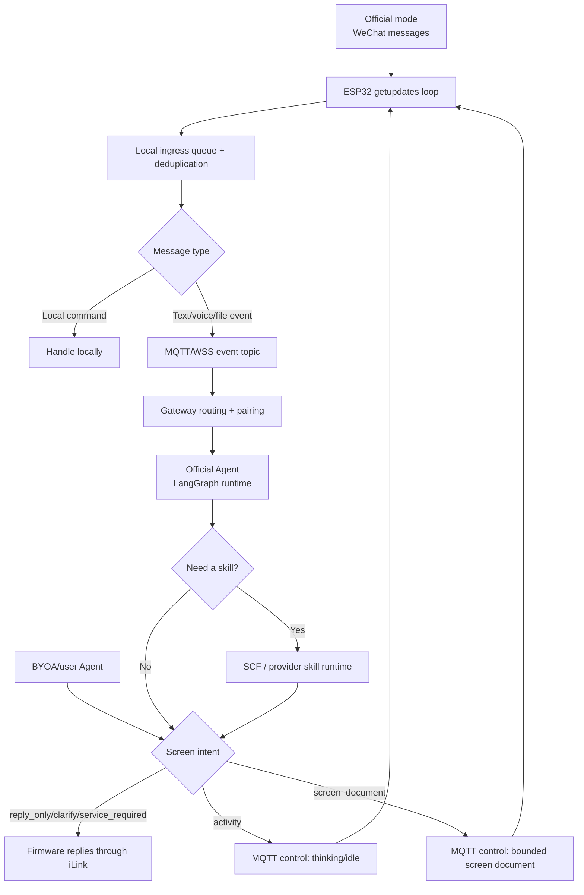

# Architecture

The ESP32 owns the WeChat session, QR login, `getupdates` loop, message receipt,
local deduplication, pending queue, commands, note persistence, rendering, and
buttons. A cloud outage must never stop the device from receiving WeChat
messages.

The next production path is MQTT-first, but ownership differs by mode. In
official mode, WeChat iLink reaches the screen first; the firmware then
publishes a bounded event with `device_context` to the gateway, and the official
Agent returns an `activity`, `screen_document`, or WeChat reply intent over the
same live device channel. In BYOA mode, the user-owned Agent controls the
screen directly over MQTT; firmware ignores WeChat/iLink as an ingress, reply
channel, fallback path, and runtime dependency.

The legacy HTTP `curator_url` path is a transition/debug adapter. It must not
remain the long-term product surface, because users should select **official**
or **custom Agent**, not copy or trust arbitrary curator URLs.

The normal production curator is no longer modeled as a single isolated cloud
function. Negotiating what should appear on the screen requires conversation
state: current draft, pending confirmation, the active screen note, user
corrections, and clear/replace intent. That lifecycle belongs to an Agent
behind the gateway. The first public implementation of that official Agent
runtime uses a pinned LangGraph flow so the path is observable but still
bounded: normalize event, select skill, run rules, optionally route to a model,
and validate the decision.

Cloud functions remain important, but as low-cost skill execution units behind
that Agent. A function may classify text, extract a file, render a screen
document candidate, or call a configured model provider. It should not be the
only place that remembers the WeChat conversation lifecycle.

The gateway or Agent does not own the WeChat token and is not allowed to sit in
front of `getupdates`. The firmware owns iLink and sends WeChat replies itself
when an Agent returns a reply intent. See [serverless-first.md](serverless-first.md)
for the low-cost runtime and retry design.

The current multi-screen identity boundary follows the PWA project: after QR
login, ilink returns `ilink_bot_id`; firmware reports it as
`wechat_id = "u_" + ilink_bot_id`. Since a screen cannot be modified without
its active WeChat bot connection, this WeChat connection id is the primary key
for cloud logs, recent decision caches, and preview isolation. `sender_ref`
continues to identify the WeChat peer for replies, but it is not the primary
screen id.

Curator behavior should be packaged as shareable skills. A cloud function is
only one adapter for executing a pinned skill version. The orchestrator decides
when a skill is needed and applies its decision to the active one-note display.
See [skill-system.md](skill-system.md).

See [cloud-agent-choice.md](cloud-agent-choice.md) for the selected cloud agent
runtime and model route.

See [curator-skill-runtime.md](curator-skill-runtime.md) for the shared skill
runtime, and [file-processing.md](file-processing.md) for the asynchronous
attachment-processing path.

## Model Execution Boundary

All model inference runs on the `weclawbot` server or in cloud functions.
The ESP32 never runs a language model, distilled model, embedding model, or
other learned message classifier.

The device remains a deterministic appliance responsible for reliable message
receipt, bounded pending storage, deduplication, local commands, note
persistence, rendering, and buttons. Model evolution must not increase the
firmware's compute or memory requirements.

See [cloud-agent.md](cloud-agent.md) for the decision contract.
