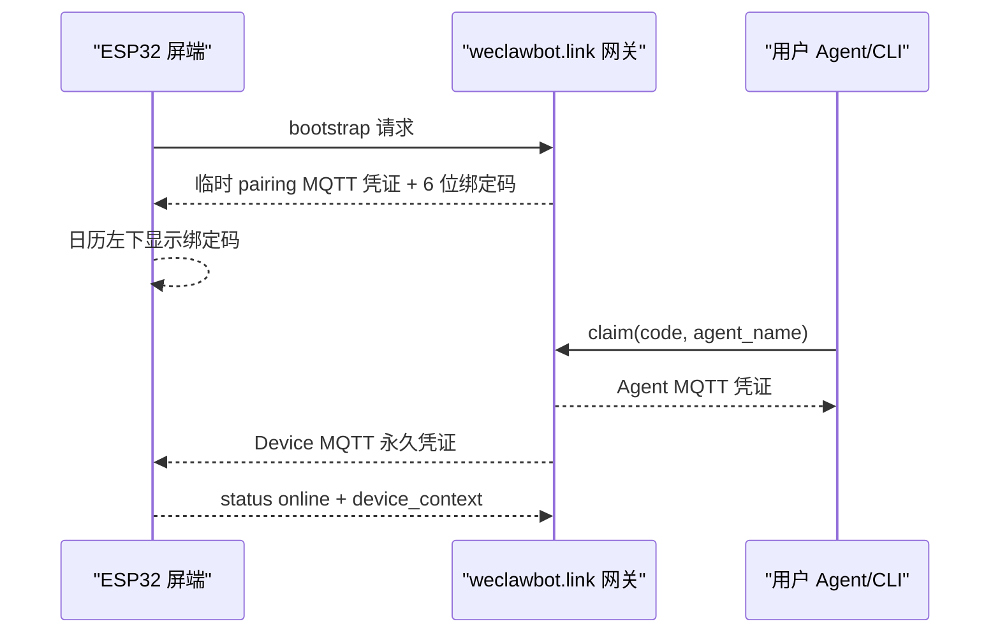
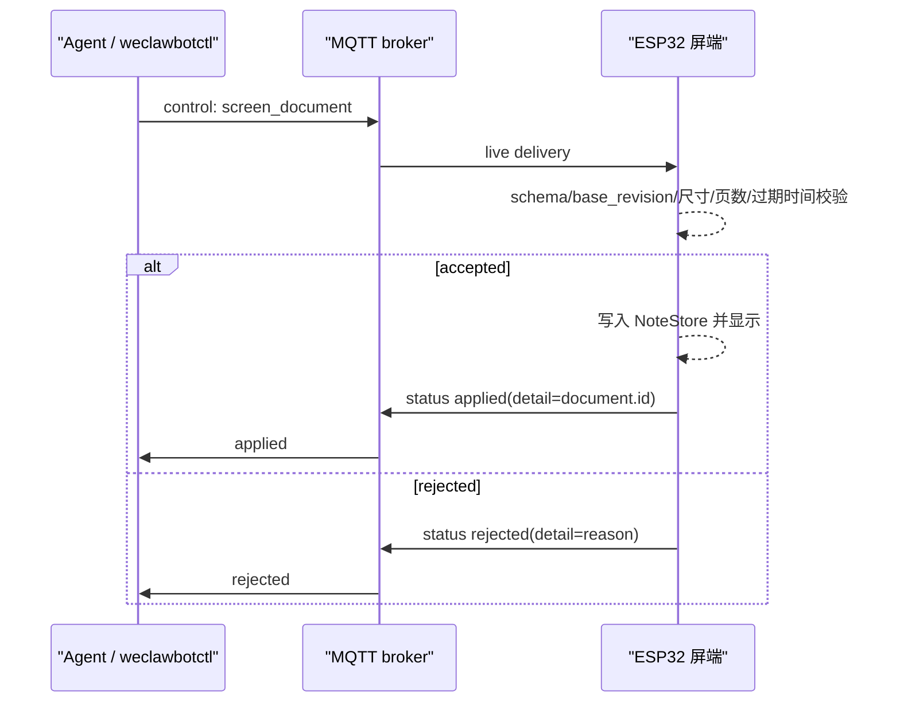
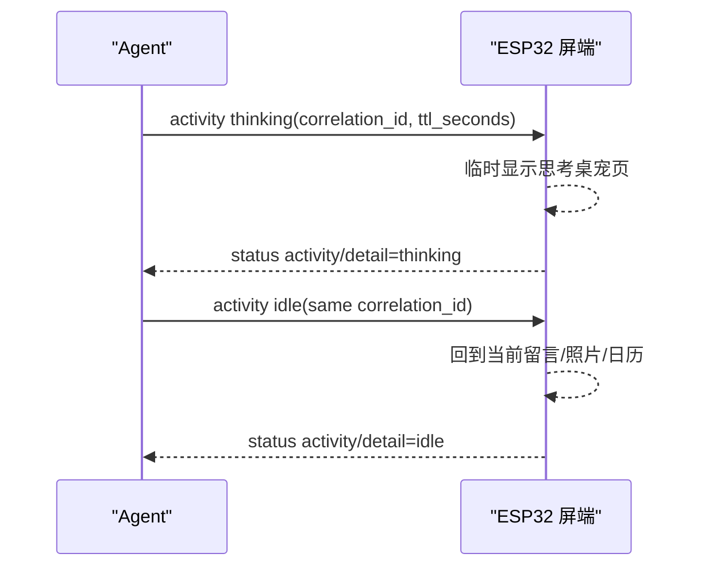

# BYOA 模式链路可靠性分析

记录日期：2026-06-27

这是一份开放讨论稿，不是最终 RFC。目标是把 BYOA（Bring Your Own Agent）
模式从“能跑通”推进到“多人、多 Agent、多入口下仍可解释、可恢复、可测试”。
欢迎后续同学直接补充反例、线上故障、测试矩阵和替代方案。

## 当前结论摘要

- BYOA 的正确产品边界是：用户自己的 Agent 接管屏幕，微信/iLink 不再作为
  控制入口。
- 屏端不接收 raw text 直上屏；Agent 必须发送预渲染的 `screen_document`
  像素文档，排版、字体、分页由 Agent 侧完成。
- 呈现效果评估应优先留在 Agent 端：生成像素图后自评可读性、拥挤度、
  分页和整体观感，再迭代。Agent skill 和模型升级成本低，固件升级重且
  用户厌烦。
- skill 升级不能破坏用户和 Agent 在使用中沉淀出来的成果。用户偏好、
  版式记忆、审美判断和工作流习惯应作为上层资产保留；WeClawBot 方主要描述
  硬件边界、协议和可观测反馈。
- `thinking` 不是屏幕内容，而是短生命周期 `activity`；`idle` 必须使用同一个
  `correlation_id` 才能回落。
- Agent 说“已经上屏”不能以 MQTT publish 成功为准，必须等屏端
  `applied`；`rejected` 和 timeout 都应视为失败。
- BYOA 下行控制是 live-only：不使用 retained message，不提供离线命令队列。
  这降低误投和过期命令风险，但需要 UI/Agent 明确告诉用户“设备离线则不会执行”。
- 重新配对是云端 owner 切换，不是旧 Agent 自觉退出。新绑定生效后，旧 Agent
  的 MQTT 凭证必须被撤销，旧 Agent 再发“上屏”应得到明确拒绝，不能误更新屏幕。

## 参与方

| 参与方 | 职责 | 当前可靠性关注点 |
| --- | --- | --- |
| ESP32 固件 | 显示、配对、校验 MQTT control、发布 status/events | 内存紧、网络重连、屏幕刷新慢、状态回执要准确 |
| `weclawbot.link` 网关 | bootstrap、pairing、MQTT 凭证、ACL | 绑定生命周期、凭证撤销、VPS 防火墙/TLS/Redis 恢复 |
| MQTT broker | WSS/MQTT pub/sub | ACL 隔离、client id 冲突、QoS 策略 |
| `weclawbotctl` | 通用 CLI、配对、doctor、screen/activity 发布 | 必须等待屏端回执，错误要可解释 |
| OpenClaw/Hermes 插件 | Agent 工具注入、技能说明、任务编排 | 工具是否被 Agent 正确调用、是否误用 Canvas/raw text |
| 用户自定义 Agent | 理解用户意图、渲染像素文档、发布控制 | 并发任务、过期上下文、错误恢复 |
| 定时任务/脚本 | 状态卡、自动化上屏 | 不应抢用户当前屏幕，不应误清 thinking |

## 主链路

### 1. 配对链路



可靠性要点：

- 绑定码短时有效，过期自动刷新。
- Device 和 Agent 使用不同 MQTT 凭证与 ACL。
- BYOA 与官方模式设备 id 前缀分离，避免 ACL 串台。
- 设备本地凭证丢失但 Redis 仍有旧 binding 时，需要 bootstrap repair/revoke。
- 同一物理 `device_id` 成功 claim 新 Agent 时，网关必须把 active binding
  切到新 owner，撤销旧 Agent/device 凭证，并尽量踢掉旧 MQTT 会话。

### 2. 屏幕文档链路



当前已做：

- 固件只接受 `weclawbot.screen_document.v1`。
- 内容区为 `368 x 206 mono1`，最多 3 页；照片相框为 `400 x 300 mono1`，
  1 页。
- `base_revision` 防止旧上下文覆盖新屏；`force_replace` / `base_revision="*"`
  作为显式覆盖通道。
- `weclawbotctl screen` 默认等待屏端 status，只有 `applied` 才返回成功。

仍需讨论：

- `rejected` 回执目前只带 reason，缺少 `control_id` / `document_id` 的结构化
  关联字段。并发命令下，CLI 可能把别的命令的 rejection 当成自己的结果。
- status 上行当前偏向 QoS 0，以降低 ESP32 内存压力；这会带来“屏端已处理但
  Agent 未收到回执”的假超时。是否需要 status 序号、短期重发或轻量 ack 表？
- `force_replace` 是否应只允许显式用户动作，而不是让定时任务或自动化默认使用？

### 3. 思考态链路



当前已做：

- `thinking` 必须带 `correlation_id` 和 5 到 120 秒 TTL。
- 固件记录当前活动 id 和截止时间。
- `idle` 必须匹配当前活动 id；错误 id 会被拒绝为
  `activity_correlation_mismatch`，不会清掉正在显示的思考态。
- 串口 `WEC:GET` 和 `device_context.agent_transport` 暴露当前 activity id 与
  剩余秒数，便于配置页和 Agent 诊断。
- TTL 到期会自动回落，避免桌宠长期停在“思考中”。

仍需讨论：

- `weclawbotctl thinking/idle` 当前主要确认 publish，不像 `screen` 一样等待
  `activity` 回执。是否需要默认等待屏端 status？
- 多 Agent 共享同一 MQTT profile 时，`correlation_id` 能防止误清 thinking，
  但不能防止另一个 Agent 立即发送新的 `thinking` 或 `screen_document`。
  是否需要本地 profile lock、active controller lease 或 actor namespace？
- 思考态现在是临时切到日历/桌宠页，不是叠加在当前照片/留言上。这对 RLCD
  更稳，但是否符合用户预期，需要实际体验反馈。

## 已验证事实

截至 2026-06-30：

- 真机已刷入并验证 `0.1.77`：
  - `agent_mode=byoa`
  - `agent_paired=true`
  - `agent_mqtt_connected=true`
  - `agent_transport_state=online`
- 100 服务器通过 `/home/csc/.npm-global/bin/weclawbotctl` 实测：
  - `thinking --id <id>` 后屏端进入 `activity/thinking`
  - 错误 `idle --id wrong-<id>` 被屏端拒绝为
    `activity_correlation_mismatch`
  - 正确 `idle --id <id>` 可回落并清空 activity id
- `@openbrt/weclawbotctl@0.1.20` 当前版本已发布：
  - `screen` 默认等待 `applied/rejected`
  - OpenClaw 插件声明 `contracts.tools`
  - 提供 `weclawbot_status`、`weclawbot_publish_screen_document`、
    `weclawbot_publish_activity`
  - 成功上屏后写入 preview manifest；OpenClaw hook 可在当前 TG/UI 会话自动回传
    PNG 效果图
  - 明确 packed mono1 的 `1=黑墨`、`0=白纸`，并对大面积黑底发出 warning
- OpenClaw 管理 UI 和 Telegram bot 的主要误判已定位：
  - 旧插件只确认 MQTT publish，不等屏端回执
  - 空 `base_revision` 被固件拒绝为 `stale_screen_revision`
  - cron 状态卡曾误以为 publish 即成功，实际被屏端拒绝

## 当前风险清单

| 风险 | 现状 | 影响 | 候选处理 |
| --- | --- | --- | --- |
| status 缺少结构化关联 | `applied` detail 通常是 document id，`rejected` 多为 reason | 并发时 CLI/Agent 可能误认回执 | status v2 增加 `control_id`、`document_id`、`activity_correlation_id` |
| status QoS 0 丢失 | 为节省内存而采用 | 可能出现假 timeout | 增加序号、短期重发、或仅关键 status QoS 1 |
| 旧 Agent 继续持有本地凭据 | 用户从 OpenClaw 切到 Hermes 后，旧 OpenClaw 仍有 `agent-mqtt.json` | 旧 Agent 可能误报“已上屏”或继续控制屏幕 | 云端 active binding/generation 为权威；新 claim 撤销旧 ACL，旧 publish 返回 `credential_revoked` / `not_current_owner` |
| 多本地 Agent 共享凭据 | 当前允许复用同一 MQTT profile | 互相覆盖屏幕或抢占 thinking | 本地锁、actor namespace、控制租约、审计字段 |
| 定时任务抢屏 | 100 cron 已局部修复 | 用户内容可能被状态卡覆盖 | 把 cron 模式产品化：只在 base revision 匹配时续写 |
| 离线命令不排队 | 设计上 live-only | 用户可能以为任务稍后会执行 | CLI/Agent 明确报告 offline，不承诺排队 |
| `force_replace` 滥用 | CLI/插件支持 | 自动化绕过 stale 保护 | 默认禁用，要求明确用户意图或高权限工具 |
| Agent 忽略页数事实 | 固件只消费像素，不再拆页 | 用户期待分屏但实际只有一页，或反过来页数过多 | skill/validator 说明 `pages.length` 就是真机页数，Agent 按用户偏好自评 |
| 清屏被渲染成纯色图片 | 已在 `0.1.14` 补 `screen_clear` 工具和纯色内容页硬拒绝 | 屏幕显示黑屏/白屏，且固件状态仍认为有一条 note | 清屏意图只允许走 `screen_clear`；Agent/CLI/插件不得发布纯色 `screen_document` 模拟 |
| 版面策略下沉到固件 | 固件升级成本高，且会锁死后续模型能力 | 用户被迫频繁刷固件，Agent 创作空间变小 | 固件只保留像素协议和硬件边界，呈现策略在 skill/tool 层演进 |
| skill 升级覆盖本地偏好 | 包升级比固件容易，反而更容易频繁发生 | 用户和 Agent 共同沉淀的版式习惯被重置 | skill 只提供硬件边界和默认起点，本地偏好优先且需向后兼容 |
| 配置/文案漂移 | BYOA/官方两套入口 | 用户误扫微信或误以为 BYOA 仍用微信 | 配置页、屏端、README 同步检查 |
| OpenClaw 环境差异 | 100 有自签证书/SAN 修复 | 其他用户可能遇到不同 gateway TLS/PATH 问题 | `openclaw doctor` 输出可操作诊断，不写死 100 路径 |
| OpenClaw 直接任务无 thinking | `0.1.15` 用 conversation hook 自动包住提到屏幕的 turn | Telegram/UI 长程任务期间真机无反馈 | 安装器开启 hook 权限，hook 失败只降级不阻塞 agent |
| 上屏后无效果预览 | `0.1.19` 改为 publish manifest + OpenClaw hook 确定性回传，TG 路径已初测通过；非 OpenClaw Agent 仍需自己发送 `preview.pages[].path` | 用户只能看到文字“已发送”，无法确认版式 | 预览是 Agent 的用户可见交付物；OpenClaw 用 hook 补强，其他 Agent 遵循同一交付契约 |
| 首次上屏黑底白字 | `0.1.20` 明确 mono1 位语义，validator 对高墨量页面发 warning；Hermes 本地模板已修正 | 初次印象差，且可能被误认为固件显示问题 | skill/tool 层默认白底黑字、预览自检；不把审美策略下沉固件 |

## 建议的可靠性分层

### P0：不能误导用户

- Agent 不得在未收到 `applied` 时说“已上屏”。
- BYOA 下微信入口必须忽略，不触发 thinking、不上屏、不回微信。
- 重绑后旧 Agent 必须失去 owner 权限；旧 MQTT 凭据不能继续控制屏幕。
- 屏端拒绝过期或不匹配的 `base_revision`。
- 屏端拒绝错误 activity id 的 `idle`。
- 不把字体、换行、分页审美写死进固件；固件只做硬件边界校验和显示。
- skill 升级不得覆盖用户和 Agent 已经沉淀的偏好，除非用户明确要求或触碰硬件边界。
- 清屏不得用黑图、白图或空白 `screen_document` 模拟，必须使用 `screen_clear`。

### P1：并发和重试可解释

- 所有 status 带 `control_id`。
- CLI 对 `screen`、`thinking`、`idle` 都能等待屏端回执。
- 定时任务只更新自己创建的状态卡，不抢用户/Agent 内容。
- 本地多 Agent 共用 profile 时，有可见的 actor/source 字段。
- validator/skill 说明硬件边界和页数事实，Agent 在发布前按用户偏好自检。
- Agent 发布前尽量自评实际 bitmap 预览；不满足用户/Agent 已沉淀标准时重新生成，不依赖固件补救。
- OpenClaw 直接会话发布屏幕内容后，应把实际 mono1 页面预览发回会话，不能只说“已发送”。
- 本地偏好/记忆应与可升级包分离存储，升级后继续生效。

### P2：长期维护友好

- `doctor` 能检查 npm 全局 bin、OpenClaw 插件、gateway TLS、MQTT 在线性。
- 配置页展示最近一次 `applied/rejected`、activity id、剩余 TTL。
- 文档示例覆盖 Codex、Hermes、OpenClaw、shell script。
- 可靠性测试矩阵纳入 release checklist。

## 测试矩阵草案

| 场景 | 期望结果 | 自动化程度 |
| --- | --- | --- |
| BYOA 配对码过期后刷新 | 旧码不可 claim，新码可 claim | 可脚本化 |
| OpenClaw 绑定后切到 Hermes 重新配对 | Hermes 可上屏；旧 OpenClaw 再发上屏被明确拒绝，屏幕不变 | 需要私有云端/真机 E2E |
| `screen_document` 正常上屏 | CLI 等到 `applied` | 已部分脚本化 |
| 空 `base_revision` 覆盖非空屏 | 固件 `rejected: stale_screen_revision` | 可脚本化 |
| `--force` 覆盖 | 固件 `applied` 且更新 revision | 已真机验证 |
| `thinking` + 正确 `idle` | 进入 thinking 后回落 | 已真机验证 |
| `thinking` + 错误 `idle` | rejected，不回落 | 已真机验证 |
| 用户要求或偏好需要多页 | Agent 生成对应页数，且 `pages.length` 与真机一致 | 待补 |
| 用户偏好一页表达 | Agent 在硬件边界内生成 1 页，且发布前自评通过 | 待补 |
| MQTT 离线发布 | CLI/Agent 报 offline 或 timeout，不声称成功 | 待补 |
| status 丢包模拟 | CLI timeout 但不重复误写屏 | 待补 |
| 两个 Agent 并发 screen | stale 保护或 actor 策略生效 | 待补 |
| cron 与用户内容并发 | cron 不抢屏 | 100 已局部验证，待产品化 |

## 待讨论问题

1. 是否接受 BYOA 永远 live-only，还是需要一个可选 mailbox？
2. 多 Agent 共享同一 MQTT profile 是优势还是风险？是否需要“当前控制者”概念？
3. `force_replace` 应该暴露给所有插件工具，还是只给 CLI/高级用户？
4. status v2 是否必须在下一版做，还是先靠 `document.id` 和 timeout 约束？
5. Activity 是否也要像 screen 一样默认等待回执？
6. 定时状态卡是 BYOA 的通用能力，还是 OpenClaw 示例项目的私有脚本？
7. 屏端是否需要显示“最近一次拒绝原因”，帮助用户理解为什么 Agent 说失败？
8. 配置页是否应提供“测试 thinking / 测试上屏 / 查看最近回执”的诊断区？
9. 单页/多页可读性是否需要自动评分，还是先靠 skill 规则和人工验收？
10. 是否需要提供“可选参考 renderer/预览评分器”帮助低能力 Agent，同时保证高级
    Agent 可以直接提交自己生成的更好像素文档？
11. 用户和 Agent 的版式偏好应存在哪里，才能既跨 skill 升级保留，又方便用户
    查看、修改和迁移？

## 讨论记录模板

后续同学可以按这个格式补充：

```md
### 2026-xx-xx / 讨论者

- 观察到的问题：
- 复现步骤：
- 期望行为：
- 建议方案：
- 风险或反对意见：
```

## 相关文档

- [architecture.md](architecture.md)
- [agent-direct-control-protocol.md](agent-direct-control-protocol.md)
- [npm-distribution.md](npm-distribution.md)
- [current-progress.md](current-progress.md)
