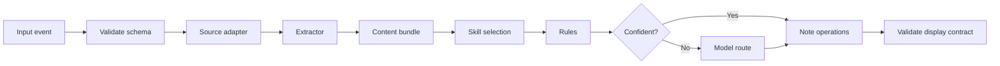

# WeClawBot Curator Skill Runtime

The Curator Skill Runtime is the reusable engine that turns WeChat text, voice
transcripts, images, documents, slides, and sheets into constrained sticky-note
operations.

It is independent of monetization. The same runtime can run as a local CLI, on
the `weclawbot` host, inside a Tencent Cloud Function, or in offline
evaluation.

## Runtime Pipeline



The important product abstraction is the `ContentBundle`: every source becomes
the same normalized material before a skill decides what should appear on the
400 x 300 display.

## Content Bundle

```json
{
  "version": 1,
  "event_id": "wx_...",
  "source": {
    "kind": "pdf",
    "filename": "物业通知.pdf",
    "sender_ref": "local-pseudonymous-id"
  },
  "blocks": [
    {
      "type": "heading",
      "text": "停水通知",
      "page": 1
    },
    {
      "type": "paragraph",
      "text": "6 月 12 日 09:00-12:00 小区停水，请提前储水。",
      "page": 1
    }
  ]
}
```

Supported block types should stay small at first:

| Block | Use |
| --- | --- |
| `text` | Plain WeChat text or voice transcript |
| `heading` | Document title, slide title, section title |
| `paragraph` | Extracted prose |
| `list_item` | Bullet, numbered item, todo |
| `table` | Rows from DOCX, XLSX, CSV, or PDF tables |
| `image_ocr` | Text extracted from an image or scanned page |
| `slide` | PPTX slide summary and speaker notes |
| `metadata` | Filename, page count, sheet name, timestamp |

Skills operate on these blocks, not raw files.

## Source Adapters

| Source | Adapter responsibility |
| --- | --- |
| WeChat text | Wrap text as one `text` block |
| WeChat voice with `voice_item.text` | Wrap the transcript as one `text` block; never execute slash commands |
| Image | OCR or vision extraction into `image_ocr`, `text`, and `metadata` blocks |
| PDF | Extract embedded text first; OCR scanned pages only when needed |
| DOCX | Parse OOXML paragraphs, headings, lists, and tables |
| PPTX | Parse slide titles, bullets, notes, and per-slide metadata |
| XLSX / CSV | Parse sheet names, headers, rows, dates, amounts, and selected ranges |

Raw audio is a fallback source only when WeChat does not provide a transcript
or a specialized skill explicitly needs acoustic information.

## Skill Responsibilities

A skill decides what to do with a content bundle:

- ignore low-value content;
- create one concise sticky note;
- split a large file into a few useful notes;
- merge new information into a related note;
- ask for clarification;
- return `service_required` when the runtime lacks a required extractor,
  model, credential, or compute budget.

The skill does not parse binary formats itself. Extractors are runtime
capabilities; skills consume normalized blocks and output note operations.

## Runtime Responsibilities

The runtime owns:

- source schema validation;
- size and type limits;
- extractor sandboxing;
- content-bundle validation;
- skill loading and version pinning;
- deterministic rules;
- model routing for uncertain cases;
- output schema validation;
- display contract enforcement;
- regression evaluation.

This keeps shareable skills small and reviewable while still allowing the
runtime to support many media types.

## Runtime Targets

| Target | Purpose |
| --- | --- |
| Local CLI | Develop extractors and skills with fixture files |
| Offline evaluator | Run regression cases and compare models |
| `weclawbot` host | Development service and emergency fallback |
| Tencent Cloud Function | Low-idle-cost production adapter |

The ESP32 is not a runtime target. It only receives validated note operations
and renders them locally.

## First Milestone

Build `sticky-core` with:

- text and WeChat voice transcript adapters;
- image OCR adapter;
- PDF embedded-text adapter;
- DOCX paragraph/table adapter;
- PPTX title/bullet adapter;
- XLSX/CSV sheet adapter;
- `sticky.v1` note operation validator;
- JSONL regression tests.

Once this works locally, the Tencent Cloud Function adapter can simply call the
same runtime entrypoint.

See [scf-build-deploy.md](scf-build-deploy.md) for how the same runtime should
be packaged into Tencent Cloud Functions from local development, CI, or the
`weclawbot` host.

See [dynamic-scf-builder.md](dynamic-scf-builder.md) for how the cloud control
plane can build new SCF variants when a signed skill or extractor capability is
introduced.
