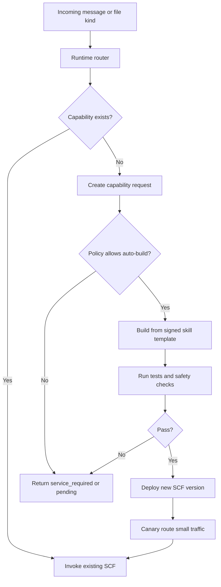

# Dynamic SCF Builder

WeChat input is unpredictable. WeClawBot therefore needs a cloud-side builder
that can create, package, test, and deploy Tencent Cloud Function variants when
new curator skills or attachment extractors are introduced.

Dynamic SCF building is a control-plane capability. It must not mean generating
and deploying arbitrary code from a single user message.

## Principle

Build dynamically from trusted inputs only:

- signed skill packages;
- reviewed extractor adapters;
- pinned dependency lockfiles;
- known runtime templates;
- explicit operator or policy approval.

Never build directly from raw WeChat content, model-generated code, filenames,
or document contents.

## Flow



The device still sees the same contract: pending, service prompt, or validated
note operations. The dynamic builder is invisible to the ESP32.

## Build Unit

A build unit is not a single message. It is a reusable capability:

```text
skill_id + skill_version
+ runtime_version
+ extractor_set
+ lockfile_hash
+ deployment_target
```

Examples:

- `sticky-core@1.0.0` for text and WeChat voice transcripts;
- `pdf-to-sticky@1.0.0` with embedded-text extraction;
- `pdf-to-sticky@1.1.0` with OCR fallback;
- `sheet-to-sticky@1.0.0` for XLSX/CSV;
- `image-to-sticky@1.0.0` for OCR;
- `slides-to-sticky@1.0.0` for PPTX.

The builder caches artifacts by this build key. A repeated file of the same
class should reuse an existing function, not trigger another build.

## Builder Responsibilities

The builder owns:

- resolving a pinned skill and extractor manifest;
- producing a Linux-compatible package or container image;
- running unit tests, schema tests, and skill regression fixtures;
- scanning for forbidden files, secrets, and mutable remote code;
- publishing an immutable artifact;
- deploying a versioned SCF function;
- updating the runtime router;
- rolling back failed versions.

## Runtime Router

The router maps incoming content to a function:

| Input | Preferred route |
| --- | --- |
| Text | `sticky-core` |
| Voice with `voice_item.text` | `sticky-core` |
| Image | `image-to-sticky` |
| PDF with embedded text | `pdf-to-sticky` |
| Scanned PDF | `pdf-to-sticky-ocr` |
| DOCX | `docx-to-sticky` |
| PPTX | `slides-to-sticky` |
| XLSX / CSV | `sheet-to-sticky` |
| Unknown or unsupported | `service_required` or capability request |

If the route is missing and policy allows automatic capability creation, the
router creates a build request and keeps the job pending. Otherwise it returns
a service prompt.

## Safety Rules

- Do not deploy model-generated code without review.
- Do not include user files in the function package.
- Do not package API keys, WeChat tokens, or device secrets.
- Do not allow arbitrary npm package names from skill metadata.
- Do not run dependency install scripts from untrusted packages.
- Do not let one user's message create a fleet-wide function without policy.
- Deploy to a new version first, then canary, then promote.
- Keep rollback simple and fast.

## Cost Rules

- Prebuild `sticky-core`; text should never wait for a build.
- Prebuild the common attachment skills once they are stable.
- Build rare or heavy extractors lazily.
- Reuse artifacts by build key.
- Prefer zip deployment for small pure Node.js functions.
- Use container image deployment for OCR, LibreOffice, or other native-heavy
  attachment processors.

## Builder Target

The `weclawbot` host is a good first builder because it already has Linux,
Docker, Node.js, and enough RAM for packaging small functions. Later the same
builder can move to GitHub Actions or Tencent Cloud CI.

The `weclawbot` host is not a message runtime dependency. It is a build and
deployment control plane.

## Failure Behavior

If a build is unavailable, slow, or fails:

- ESP32 continues receiving WeChat messages;
- the file job stays pending with bounded retry;
- the user receives a clear service prompt if needed;
- raw chat or raw file contents are never rendered directly.
