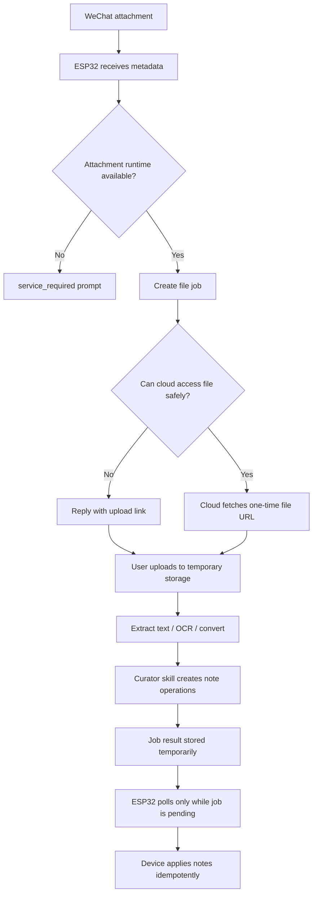

# File Processing Path

The open firmware does not parse images, raw voice audio, PDF, Word,
PowerPoint, Excel, or other binary attachments locally. It detects the message
type, uses WeChat-provided voice transcription when present, and firmware
`0.1.13` forwards WeChat image/file metadata to the Curator Skill Runtime when
the message includes a CDN URL and AES key. Until an extractor skill is
deployed, the runtime replies in WeChat asking the user to send the text or
summary that should be shown on the screen.

As of the first `0.1.13` cloud patch, `weclawbot.link` has a lightweight image
extractor in front of the curator: it downloads the WeChat image ticket,
decrypts AES media when possible, runs temporary Tesseract OCR
(`chi_sim+eng`), deletes the temporary image, and forwards recognized text as a
normal `wechat_image` content bundle when the OCR looks like stable document or
screenshot text.

As of firmware `0.1.32`, image messages can also become an idle photo frame. If
the cloud can decode a JPEG/PNG but OCR is empty or looks like noisy scene
recognition, the proxy returns `set_idle_photo` with a full-screen `400 x 300`
`mono1` frame. The device stores that frame separately from the current sticky
note. Clearing notes returns to this black-and-white photo frame; only devices
without a user photo fall back to the built-in red block pet.

When a curator decision actually updates the screen (`create_note`,
`update_note`, `replace_note`, or `merge_note`), the `weclawbot.link` proxy now
renders a 400 x 300 black-and-white PNG preview of the first displayed page and
adds a `screen_preview_url` to the decision. Firmware uses that URL internally
to download and send the preview back to WeChat as an inline ilink image; user
text replies must not expose raw preview URLs.

Attachment processing belongs to the Curator Skill Runtime because it needs a
repeatable path from raw media to normalized content blocks and then to
validated sticky-note operations. A hosted service may charge for compute,
storage, and model calls, but the runtime abstraction is not payment-specific.

## Default Open-Firmware Behavior

| Incoming content | Device behavior |
| --- | --- |
| Image with stable OCR text | Send `wechat_image` media metadata to curator; cloud proxy forwards extracted text as a normal content bundle |
| Lifestyle / pet photo | Cloud proxy renders a full-screen black-and-white idle photo frame; clearing notes shows this frame |
| Voice with `voice_item.text` | Treat WeChat ASR text as a normal text candidate |
| Voice without transcript | Show platform-service prompt; reply that advanced voice processing needs the platform service |
| PDF | Send `wechat_file` media metadata to curator when possible; otherwise show platform-service prompt |
| DOCX | Send `wechat_file` media metadata to curator when possible; otherwise show platform-service prompt |
| PPTX | Send `wechat_file` media metadata to curator when possible; otherwise show platform-service prompt |
| XLSX / CSV | Send `wechat_file` media metadata to curator when possible; otherwise show platform-service prompt |
| Unknown file | Show platform-service prompt; do not download or render |
| Executable / script / archive | Reject by default; do not process in the first service version |

The device must not render raw filenames as sticky notes. A filename may be
shown only inside the platform-service prompt.

## Attachment Processing Flow



The runtime service must never receive the device's WeChat bot token. If the
WeChat message API provides a short-lived attachment URL that does not require
the bot token, the device may send that URL as a one-time file ticket. If not,
the service sends the user an upload link and waits for the user to upload the
file to temporary storage.

The ESP32 stores only `event_id`, `job_id`, file kind, display-safe filename,
and retry state. It does not store or stream large file contents.

## Job Contract

The device creates a file job:

```json
{
  "version": 1,
  "event_id": "wx_...",
  "device_id": "weclawbot_...",
  "sender_ref": "local-pseudonymous-id",
  "kind": "pdf",
  "filename": "物业通知.pdf",
  "received_at": "2026-06-08T10:30:00+08:00"
}
```

The runtime returns:

```json
{
  "version": 1,
  "event_id": "wx_...",
  "action": "file_job_created",
  "job_id": "filejob_...",
  "user_reply": "收到文件，整理完成后会贴到 WeClawBot 屏幕。"
}
```

When the job is complete, device polling returns note operations:

```json
{
  "version": 1,
  "job_id": "filejob_...",
  "status": "done",
  "operations": [
    {
      "action": "create_note",
      "note": {
        "template": "sticky.v1",
        "title": "物业通知",
        "body": "6 月 12 日 09:00-12:00 停水，提前储水。",
        "footer": "",
        "priority": "normal"
      }
    }
  ]
}
```

Repeated job results must be safe to apply more than once. The device applies
each `(job_id, operation_id)` at most once.

## Extraction Policy

| Type | First useful behavior |
| --- | --- |
| Image | OCR obvious text; optionally use vision model for screenshots, notices, pickup codes, and forms |
| PDF | Extract embedded text first; OCR scanned pages only when needed |
| DOCX | Extract paragraphs, headings, tables, and dates from the OOXML package |
| PPTX | Extract slide titles, bullets, speaker notes, and dates; summarize per deck |
| XLSX / CSV | Extract sheet names, headers, dates, amounts, todos, and rows matching a skill |
| Voice | Use `voice_item.text` first; only process raw audio when WeChat ASR is missing or the selected skill explicitly needs audio |

Large documents should not become one giant note. The file skill should create
one to five concise notes, ask for clarification, or tell the user the file is
too large for the current service tier.

## Limits For The First Hosted Version

Initial limits should be conservative:

- image: up to 10 MB;
- PDF: up to 25 MB or 30 pages;
- DOCX / PPTX / XLSX: up to 25 MB;
- CSV: up to 5 MB;
- raw voice audio: up to 5 minutes;
- result: up to five sticky notes per file.

Reject password-protected files, encrypted archives, executable files, scripts,
Office macros, and nested archives in the first version.

## Retention And Privacy

- Raw files are temporary and deleted after processing or failure.
- Default raw-file retention should be 24 hours or less.
- Derived text and note operations are retained only as needed for audit and
  retry, preferably seven days or less.
- Do not use file contents for training or shared evaluation without explicit
  opt-in.
- Logs must contain job ids and operational status, not raw document text.

## Skill Boundary

File processing is a family of skills, not one hardcoded converter:

- `image-to-sticky`;
- `pdf-to-sticky`;
- `docx-to-sticky`;
- `slides-to-sticky`;
- `sheet-to-sticky`;
- `voice-transcript-to-sticky`;
- `voice-audio-to-sticky` for the raw-audio fallback path.

Each skill shares the same display contract and note operation schema. The
heavy extraction pipeline can differ by file type, but every final result must
be validated before the ESP32 accepts it.

See [curator-skill-runtime.md](curator-skill-runtime.md) for the normalized
content-bundle pipeline that lets these attachment skills share one runtime.
See [dynamic-scf-builder.md](dynamic-scf-builder.md) for how missing attachment
capabilities can trigger a controlled SCF build from trusted templates.
