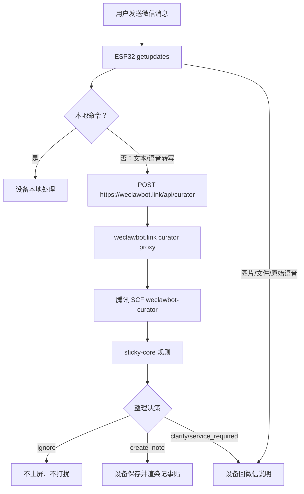
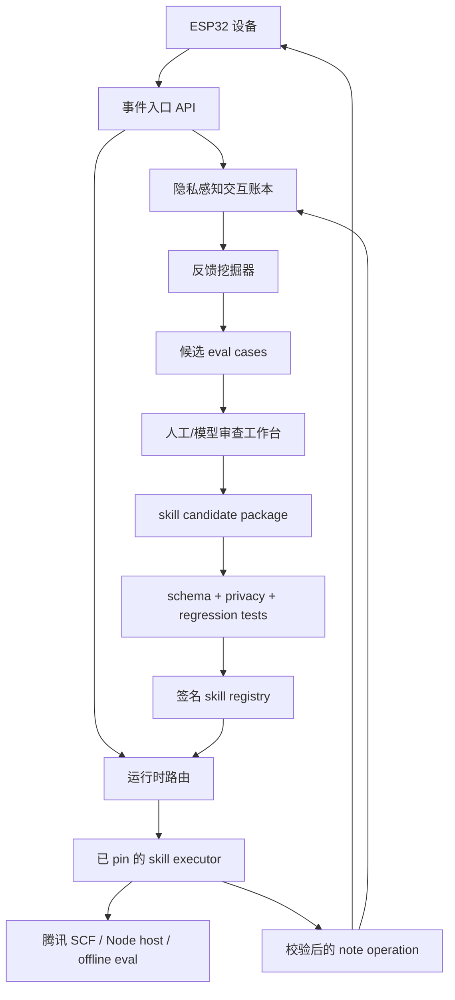

# 自动进化的电子记事贴架构讨论稿

本文记录 WeClawBot 当前需求、已实现架构、以及一个关键判断：当前系统已经具备可观察、可部署、可回滚的雏形，但它还不是一个好的“自我进化”架构。

这份文档不是最终方案，而是给其他同学参与讨论的上下文。

## 产品目标

WeClawBot 是一块基于 ESP32-S3-RLCD-4.2 的开源电子记事贴。用户扫码建立微信 bot 连接，给 bot 发消息，真正有价值的信息会被整理成适合 400 x 300 屏幕显示的记事贴。

理想产品体验是：

- 有用的信息自动变成简洁记事贴；
- 打招呼、确认、误发、表情、测试信息不打扰屏幕，也不制造微信噪音；
- 信息不完整时可以在微信里追问；
- 用户通过 `修改为...`、清屏、删除等行为反馈整理效果；
- 图片、PDF、DOCX、PPTX、XLSX、CSV 等文件最终沉淀成可共享的处理 skill；
- 系统在交互中学习，但每次能力变化都可审查、可测试、可回滚，而不是直接把日志喂给一个黑盒。

## 当前硬约束

### 设备边界

- ESP32 负责微信扫码登录、token 存储和 `getupdates`。
- 微信 token 不进入云端 agent、模型服务或第三方服务。
- 云端不可用时，设备仍应继续接收微信消息。
- ESP32 不运行语言模型、embedding、分类模型或任何学习型推理。
- 普通固件升级不应要求重新配置 Wi-Fi 或重新扫码登录微信。
- 默认运行成本要低，优先使用按需触发的云函数。

### 交互边界

- 微信文本和微信自带转写的语音可以进入记事贴整理流程。
- 本地命令必须在设备端处理：`/next`、`/prev`、`/clear`、`/clear all`。
- 用户反馈必须显式：`修改为...`、`改为...`、`改成...`。
- 不能上屏的内容应在微信里解释，不应把 agent 的分类理由显示到屏幕上。
- 没有微信消息是常态，不应存在“没有消息导致连接失效”的概念。

### 进化边界

- 真实用户消息不能未经同意变成共享训练数据或公开 eval。
- skill 必须版本化、可测试、可审查、可回滚。
- 动态构建腾讯云函数只能来自可信模板和签名 skill 包，不能来自用户消息生成任意代码。
- 模型可以提出修改建议，但发布行为必须通过 schema、回归测试和明确发布流程。

## 当前实现快照



当前已部署部分：

- 固件：`0.1.11`，运行在 Waveshare ESP32-S3-RLCD-4.2。
- 设备云端整理 URL：`https://weclawbot.link/api/curator`。
- 本地串口日志：`logs/device-current.log`。
- 服务器代理服务：`weclawbot-curator-proxy.service`。
- 服务器 agent 日志：`/var/log/weclawbot/curator-agent.log`。
- 腾讯云函数：`ap-guangzhou/default/weclawbot-curator`。
- 当前 curator runtime：`runtime/`。
- 当前 skill：`sticky-core`，版本 `0.1.3`。

当前代理解决了：

- 固定域名入口，不再让设备直接配置一长串 SCF URL；
- 云端请求和整理结果的结构化日志；
- `ignore` 回复降噪，避免“你好/测试”也收到莫名其妙回复；
- 测试期间能看到“设备请求 -> 云端决策”的链路。

当前固件解决了：

- 屏上微信扫码登录；
- 设备端 `getupdates`；
- `WEC:` 结构化串口事件；
- `getupdates_poll` 空轮询日志，可以区分“没有消息”和“连接异常”；
- 云端整理时的“红方块思考中”状态；
- 本地记事贴存储、渲染、翻页、清除。

## 为什么这还不是自我进化

当前架构解决的是“可观察”和“可部署”，不是“可进化”。

主要缺口：

- 日志不是交互账本。现在的日志是运维 trace，不包含隐私状态、用户授权、审查状态、版本血缘。
- 用户反馈没有进入云端学习闭环。`修改为...` 目前主要是替换当前贴，并不会自动形成可审查的 skill 改进事件。
- 没有 skill registry。`sticky-core` 仍是代码模块，不是签名、发布、可 pin、可回滚的 skill 包。
- 没有 eval 生成流程。真实失败不能自动沉淀成脱敏样例、回归测试和发布门禁。
- 没有发布晋级流程。现在可以直接改规则并部署 SCF，但缺少 candidate -> review -> canary -> publish -> rollback。
- 代理只是运行时中转，不应让产品智能在代理层意外堆积。
- SCF 是执行器，不是 skill 本身。如果把每个云函数都当成 agent，能力会难以共享、审计和复用。
- 文件处理仍停留在提示阶段，还没有 extractor job、存储策略、成本上限、异步状态和 note operation 校验。

一句话：当前系统能回答“刚才发生了什么”，但还不能回答“系统学到了什么、谁审查了、哪个 skill 版本变化了、为什么可以安全发布”。

## 下一版讨论架构

建议把系统拆成四层：

1. 设备运行时
2. agent 执行运行时
3. 进化控制面
4. skill registry / marketplace



### 设备运行时

ESP32 保持确定性：

- 接收微信消息；
- 去重；
- 保留有限 pending 队列；
- 调用配置的 curator endpoint；
- 应用校验后的 note operation；
- 渲染记事贴；
- 处理按键和本地命令；
- 输出结构化设备日志。

设备不负责学习，也不下载模型。设备只报告事件、应用结果。

### Agent 执行运行时

agent 执行运行时负责把标准化事件变成标准化 note operation。

它应支持：

- 规则优先；
- 低置信度或复杂内容才调用模型；
- 按 `event_id` 幂等；
- 明确 action schema：`ignore`、`create_note`、`clarify`、`service_required`，后续再扩展 `update_note`、`merge_note`；
- 明确失败行为；
- 低成本云函数执行。

腾讯 SCF 应该只是运行某个已 pin skill 版本的执行器，而不是 skill 的事实来源。

### 进化控制面

真正的“自我进化”应发生在控制面，而不是 ESP32，也不是某一个 SCF 里。

控制面职责：

- 记录交互事件，并标注隐私状态；
- 关联原始消息、agent 决策、上屏结果、微信回复和用户反馈；
- 对敏感内容做脱敏或摘要；
- 从反复失败和显式修正里生成候选 eval；
- 允许人或模型审查、编辑、拒绝候选修改；
- 运行 schema 校验和回归测试；
- 灰度发布 skill；
- 发布签名 skill 版本；
- 支持回滚。

### Skill Registry

skill 应该是可共享行为包，而不是散落在云函数里的代码。

建议形态：

```text
skills/sticky-core/
├── skill.yaml
├── policy.md
├── schemas/
├── rules/
├── prompts/
├── renderers/
├── eval/
└── adapters/
```

每个 skill 版本声明：

- 支持的输入类型；
- 支持的输出操作；
- 显示模板；
- 成本等级；
- 模型路由策略；
- 隐私要求；
- 回归样例；
- 兼容的固件能力范围。

设备可以 pin 到某个 skill id + version，也可以选择 `stable`、`beta`、`local-dev` 之类的 channel。

## 为进化准备的事件模型

自我进化需要结构化事件，不只是日志行。

候选实体：

| Entity | 用途 |
| --- | --- |
| `DeviceEvent` | 设备观察到的事件元数据和脱敏内容 |
| `AgentDecision` | skill 版本、action、confidence、note operation、trace |
| `DisplayResult` | 是否上屏、失败、替换、清除 |
| `UserFeedback` | 澄清、修正、删除、确认、投诉 |
| `EvalCandidate` | 从交互中生成的脱敏候选样例 |
| `SkillVersion` | 签名 skill 包和测试结果 |
| `Deployment` | 哪个 runtime 为哪个设备执行了哪个 skill 版本 |

重要字段：

- `event_id`
- `device_id`
- `sender_ref`
- `skill_id`
- `skill_version`
- `runtime_id`
- `action`
- `note_operation`
- `user_reply`
- `feedback_type`
- `privacy_state`
- `review_state`
- `created_at`

## 文件和附件方向

图片、PDF、DOCX、PPTX、XLSX、CSV 不应永远只是“付费提示”。它们应沉淀为 extractor skills，并输出同一套 note operation schema。

可拆分为：

- 图片 OCR skill；
- PDF 文本提取 skill；
- DOCX/PPTX/XLSX/CSV 结构化提取 skill；
- 文档摘要 skill；
- “询问用户希望显示什么”的澄清 skill；
- 最终 sticky-note formatter skill。

每个文件 skill 都必须声明成本等级、存储时长、隐私规则和失败行为。

## 当前架构风险

- `weclawbot.link` 代理如果继续加业务逻辑，可能变成无规划的中心 agent。
- 动态 SCF 构建如果没有可信模板边界，会滑向危险的动态代码部署。
- 日志可能包含私密消息，需要明确留存、脱敏和授权策略。
- 单一全局 `sticky-core` 会难以适配不同用户对“哪些内容值得上屏”的判断。
- 微信回复策略如果不基于反馈调整，会继续产生打扰。
- 文件处理如果不做异步、限额和可观察，很快会变贵且难排障。

## 需要讨论的问题

1. WeClawBot 是否现在就需要中心化交互账本，还是先做本地/离线 review？
2. 用户什么动作算同意把消息脱敏后用于 eval？
3. 是否每条上屏结果都要请求反馈，还是只通过修正和清除隐式反馈？
4. 设备应 pin 精确 skill 版本，还是订阅 `stable/beta` channel？
5. `weclawbot.link` 应继续只做代理，还是承担控制面 API？
6. 第一个文件 skill 应选图片 OCR、PDF 文本，还是 Office/CSV？
7. 最小可用的 skill review workbench 长什么样？
8. 开源项目里的共享 skill 如何签名、发布和撤回？

## 建议下一步

不要继续把智能堆到当前代理里。

先做最小进化闭环：

1. 存储脱敏后的 `DeviceEvent`、`AgentDecision`、`UserFeedback`。
2. 增加显式反馈命令，让修正进入云端反馈事件。
3. 把审查后的反馈转成 `runtime/eval/*.jsonl`。
4. 发布新 skill 前强制跑 `npm run eval`。
5. 加一个简单 skill manifest，让设备 pin 到 skill 版本。

等这个闭环存在后，再扩展动态 SCF 构建和文件处理 skill。
