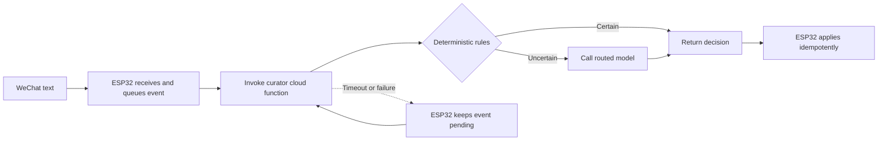

# Serverless-First Curator

The default production curator is a Tencent Cloud Function triggered only when
an ESP32 has received a new text candidate. There is no required always-on
agent service.

## Request Path

The ESP32 calls the function synchronously because it needs the normalized
curation decision. A timeout or provider failure is not a message-receipt
failure: the device keeps the event pending and retries with bounded backoff.

## Cost Boundary

- Do not configure provisioned concurrency for the normal low-volume path.
- Do not require Redis, Postgres, a queue service, or an always-on host for the
  first production version.
- Run cheap deterministic rules before any model call.
- Call a model only for ambiguous text that cannot be classified safely.
- Keep function requests and responses small.
- Keep verbose cloud logs disabled by default and retain only operational
  metrics and explicitly authorized audit samples.

Tencent Cloud Function code that is not actually running does not incur
resource-use charges unless provisioned concurrency is configured. Function
invocations, execution time, outbound traffic, model-provider usage, and any
attached cloud products remain billable.

## Stateless Function Contract

The first production function is intentionally stateless. The ESP32 owns:

- the pending event queue;
- retry scheduling;
- event deduplication;
- applied-decision deduplication;
- note persistence.

Every request includes an `event_id`, and every response echoes it. Repeated
responses are harmless because the device applies each `event_id` at most once.
Persistent cloud-side idempotency storage can be added later only if a concrete
workflow requires it.

## Skill Packaging

The curator behavior is maintained as a versioned skill containing:

- request and response schemas;
- deterministic rules;
- model prompt and routing policy;
- fixed regression cases;
- privacy and retention policy.

The same skill can run in a Tencent Cloud Function or on the `weclawbot` host
for development and emergency fallback. The function is the preferred
low-operating-cost production target; the host is not a required hop.

See [skill-system.md](skill-system.md) for the shareable skill package,
display-format contract, and note-update operation model.

## Authentication

The function endpoint must reject unsigned requests. Each provisioned device
receives a revocable device credential and signs the request body, timestamp,
and nonce. The endpoint enforces a short timestamp window, nonce replay
protection where practical, per-device rate limits, and credential revocation.

Never embed a shared fleet-wide secret in public firmware.

## Heavy Work

Documents, images, raw voice audio, OCR, transcription, and conversion use a
separate asynchronous function path. These tasks must not increase latency or
cost for ordinary text curation.

See [file-processing.md](file-processing.md) for attachment handling, upload
fallbacks, job polling, supported file types, and retention limits.

See [curator-skill-runtime.md](curator-skill-runtime.md) for the shared runtime
that lets text and attachment skills use one note-operation contract.

See [scf-build-deploy.md](scf-build-deploy.md) for the build, packaging, and
deployment policy for Tencent Cloud Functions.

Official references:

- [Tencent Cloud Function pay-as-you-go billing](https://cloud.tencent.com/document/product/583/12284)
- [Tencent Cloud Function pricing](https://cloud.tencent.com/document/product/583/12281)
- [Tencent Cloud Function concurrency](https://cloud.tencent.com/document/product/583/45757)
